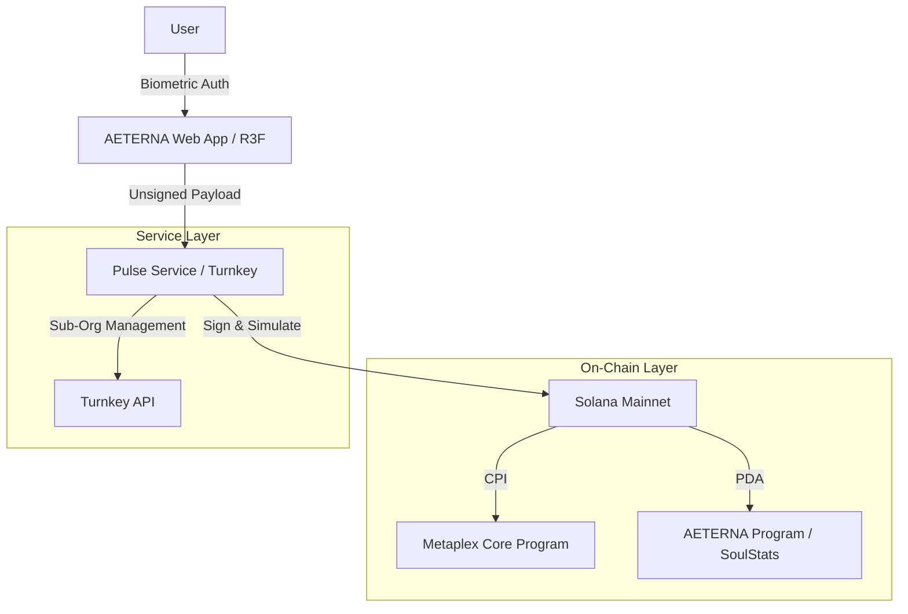

# AETERNA: Infinite Evolution Protocol


> [!NOTE]
> **Status**: *High-fidelity "Industrial Futurism" cinematic renders are currently being processed. Placeholders are active until finalized.*

AETERNA is a state-of-the-art **Invisible Web3** ticketing and loyalty protocol. Built for high-end festivals and elite social circles, it eliminates the friction of blockchain while preserving the permanence and prestige of on-chain assets.

## 🌌 The Vision: Industrial Futurism

AETERNA merges the tactile utility of industrial infrastructure with the ethereal potential of digital evolution. Every "Prestige Pass" is a unique **Metaplex Core** asset that evolves alongside its owner, powered by **Turnkey**'s non-custodial session keys.

### Design Tokens

- **Ghost Matter**: A physics-based material shader using R3F and GLSL for iridescent, semi-transparent textures.
- **Neon Obsidian**: The core structural aesthetic—dark, reflective, and precision-engineered.
- **Industrial Pulse**: Animated UI signals indicating secure on-chain synchronizations.

---

## 🏗️ System Architecture

AETERNA utilizes a 3-tier hybrid architecture to deliver a "Web2 speed, Web3 security" experience.



---

## ⚡ Technical Flows

### 1. Initialization (The Genesis)

When a user joins AETERNA, the system mints a **Metaplex Core** asset via the `initialize_pass` instruction. This creates an immutable "Dormant Slab" that serves as the foundation for the user's digital identity.

### 2. Pulse Wallet Integration (The Link)

We leverage **Turnkey** to create "Pulse Wallets"—invisible, non-custodial session keys managed via passkeys.

- **Sub-Org Creation**: Each user is assigned a unique sub-organization in Turnkey.
- **PDA Link**: The AETERNA program creates a `PulseLink` PDA deriving from `[b"pulse", asset_key]`, binding the temporary session key to the permanent NFT asset.

### 3. Infinite Evolution (The Soul)

User actions (spending USDC, scanning at events, participating in DeFi) trigger the `grant_xp` and `evolve_soul` instructions.

- **XP Engine**: Tracks activity on-chain through the `SoulStats` ledger.
- **Metaplex Core Upgrades**: When XP thresholds are met, the backend authority triggers a metadata evolution using the MPL-Core `UpdateV1` instruction, physically changing the asset's appearance from "Dormant" to "Active" or "VIP".

---

## 🛠️ Technical Integrations

### Metaplex Core (MPL-Core v0.7.0)

- **Plugin System**: Leveraged for efficient attribute management and state tracking.
- **Low Compute**: Optimized for high-frequency festival interactions to minimize latency.

### Turnkey (Pulse Service)

- **Transaction Simulation**: Every payload is simulated via Helius or Solana RPC to detect drainers or unauthorized program interactions *before* signing.
- **Sub-Organization Isolation**: Every user occupies a distinct security boundary within the Turnkey HSM.

### React Three Fiber (Spatial Frontend)

- **R3F + Cannon.js**: Physics-based interactions with digital assets.
- **Dynamic HUD**: Cinematic overlays that react to on-chain XP gains and wealth-tier shifts.

---

## 🚀 Getting Started

### Prerequisites

- **Anchor CLI**: `0.29.0`
- **Solana CLI**: `1.18.x`
- **Node.js**: `v20.x`
- **Keys**: Turnkey API Key & Organization ID.

### Installation & Launch

1. **Clone & Install**

   ```bash
   git clone https://github.com/your-repo/aeterna.git
   cd aeterna && npm install
   ```

2. **Deploy Program**

   ```bash
   cd programs/aeterna
   anchor build && anchor deploy
   ```

3. **Initialize Services**

   ```bash
   # Terminal 1: Pulse Service
   cd pulse-service && npm run dev

   # Terminal 2: Frontend
   cd frontend && npm run dev
   ```

---

## 📜 License

AETERNA is released under the MIT License. Built for the future of the Solana machine.
