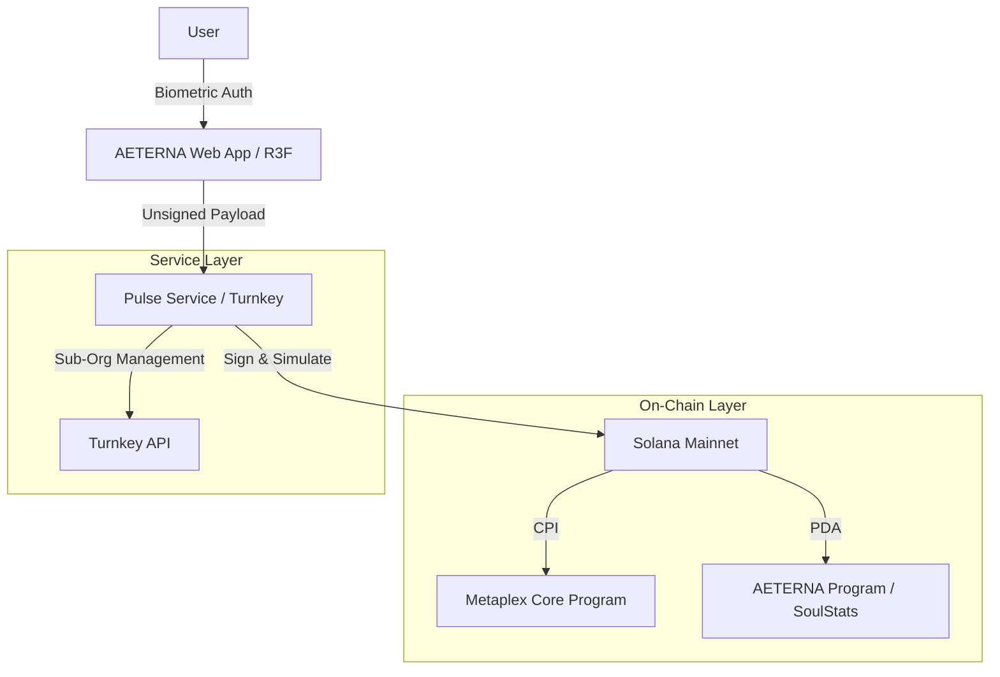

# AETERNA: Infinite Evolution Protocol


AETERNA is a state-of-the-art **Invisible Web3** ticketing and loyalty protocol. Built for high-end festivals and elite social circles, it eliminates the friction of blockchain while preserving the permanence and prestige of on-chain assets.

## 🌌 The Vision: Industrial Futurism

AETERNA merges the tactile utility of industrial infrastructure with the ethereal potential of digital evolution. Every "Prestige Pass" is a unique **Metaplex Core** asset that evolves alongside its owner, powered by **Turnkey**'s non-custodial session keys.

---

## 🏗️ System Architecture

AETERNA utilizes a 3-tier hybrid architecture to deliver a "Web2 speed, Web3 security" experience.



---

## ⚡ Technical Flows

### 1. Initialization (The Genesis)

When a user joins AETERNA, the system mints a **Metaplex Core** asset via the `initialize_pass` instruction. This creates an immutable "Dormant Slab" that serves as the foundation for the user's digital identity.

### 2. Pulse Wallet Integration (The Link)

We leverage **Turnkey** to create "Pulse Wallets"—invisible, non-custodial session keys managed via passkeys.

- **Sub-Org Creation**: Each user is assigned a unique sub-organization in Turnkey.
- **PDA Link**: The AETERNA program creates a `PulseLink` PDA deriving from `[b"pulse", asset_key]`, binding the temporary session key to the permanent NFT asset.

### 3. Infinite Evolution (The Soul)

User actions (spending USDC, scanning at events, participating in DeFi) trigger the `grant_xp` and `evolve_soul` instructions.

- **XP Engine**: Tracks activity on-chain.
- **Metaplex Core Upgrades**: When XP thresholds are met, the backend authority triggers a metadata evolution, physically changing the asset's appearance from "Dormant" to "Active" or "VIP".

---

## 🛠️ Technical Integrations

### Metaplex Core (MPL-Core)

- **Plugin System**: Used for efficient attribute management.
- **Low Compute**: Optimized for high-frequency festival interactions.

### Turnkey (Pulse Service)

- **Blind Signing Prevention**: All transactions are simulated via Helius/Solana RPC before signing.
- **Biometric Security**: Users sign transitions using FaceID/TouchID via Passkeys.

### React Three Fiber (Ghost Matter Frontend)

- **Spatial UX**: A unified, cinematic 3D environment for interacting with the "Prestige Pass".
- **SOTA Materials**: Implementation of "Ghost Matter" shaders for high-end visual feedback.

---

## 🚀 Getting Started

### Prerequisites

- Solana CLI & Anchor 0.29.0
- Node.js v20+
- Turnkey API Keys

### Installation

```bash
# Clone the repository
git clone https://github.com/your-repo/aeterna.git

# Install dependencies
npm install

# Build the Anchor program
anchor build

# Start the Pulse Service
cd apps/pulse-service && npm run dev

# Start the Frontend
cd frontend && npm run dev
```

---

## 📜 License

AETERNA is released under the MIT License. Built for the future of the Solana machine.
